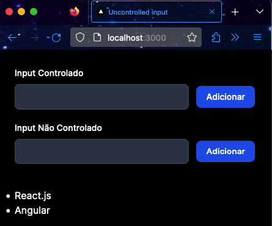
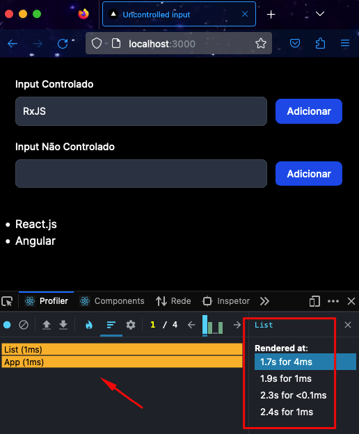
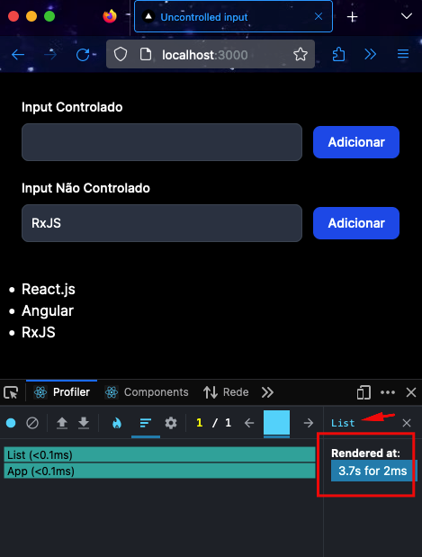

# react-uncontrolled-input-render-optimization


## Motivo
Exemplo de utilização de input não controlado (uncontrolled inputs) para evitar renderizações desnecessárias em componentes [react](https://react.dev/).

> Nesse outro repositório: https://github.com/bmenegidio/react-memo eu utilizo o "*memo*" para resolver o problema de renderização. Porém, nesse cenário a opção mais otimizada seria utilizar uncontrolled inputs, como veremos a seguir. 

## O problema
Após executar o comando `npm run dev` e acessar o seguinte endereço no browser `http://localhost:3000/`, você verá a seguinte tela:



O app possui uma lista com nomes de tecnologias e um input controlado e um não controlado, e botões para adicionar novos nomes.

Ao digitarmos "RxJS" no input controlado e analisarmos o profiler com a extensão _React Developer Tools_, podemos observar que os componentes App e List sofreram re-render 4 vezes.
Isso pode ser um grande problema se os componentes forem complexos.



Mas será que realmente precisamos gerenciar o estado do input pelo react?
Nesse contexto não faz sentido, pois não precisamos do valor do input para atualizar nada em tela. Apenas precisamos do valor ao clicar no botão "Adicionar".

Podemos então utilizar uncontrolled components, ou seja, o estado do input será controlado pelo próprio DOM.

Importamos o **useRef** do react:
```js
import { useRef } from "react";
```

Criamos um ref:
```js
const uncontrolledInputRef = useRef<HTMLInputElement>(null);
```

E vinculamos o ref criado anteriormente ao input:
```js
<input type="text"
       ref={uncontrolledInputRef}
/>
```

Dessa maneira, ao clicarmos no botão "Adicionar", podemos capturar o valor e atualizar a lista:
```js
const techName = uncontrolledInputRef.current?.value || ''

setTechnologies(currentValues => [
    ...currentValues,
    techName,
])
```

Ao digitarmos **RxJS** no input não controlado e clicarmos em "Adicionar". Veremos que o componente **List** foi renderizado apenas uma vez. Apenas o evento de click no botão disparou uma renderização. Muito mais performático.



